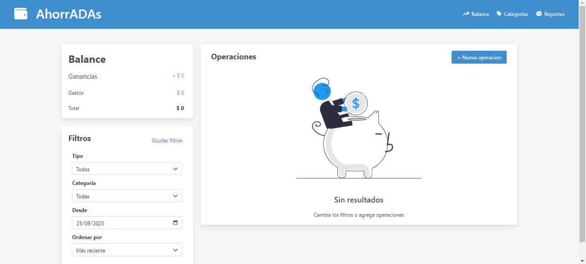

# 💲 AhorrAdas 💲
***
## _Descripción_
 Trabajo final del modulo 3 de la carrera Desarrollo Front-end, en ADA ITW en el aplique los conocimientos y herramientas aprendidos en este modulo para así
diseñar una herramienta para controlar gastos y ganancias.
***
## _Funciones de la app_
Es una herramienta con la cual podrás contolar los gastos y ganancias mes a mes.
* En la sección de Balance se puede agregar nuevas operaciones, idicando la descripción, monto, categoría y fecha.
* Tenes la opcion de poder agrgar más categorías a las que ya vienen por defecto, editar o eleiminar las ya existentes.
* Ya con un minimo de dos operaciones podras ver en la sección de Reportes un resumen mas gráfico de todos los movimientos.
* Podras filtar por tipo, categorías, fecha, ordenar por mayor o menor gasto/ganancia.
***
## _Herramientas utilizadas_
* HTML5
* Bulma
* JS - Arays - Objetos - DOM - JSON
* Git 
* GitHub
***
## _Para ver más_
Este el link de la app, podes hacer click aca o copiar y pegar en tu navegador preferido.
Esta app es totalmente adaptativa y responsive.
<a href="https://superb-croquembouche-2aa69c.netlify.app/" target="_blank">Click Aquí</a>

**Sección de Balance**

**Sección para agregar una Nueva Operación**

**Sección de Categorías**

**Sección de Reportes**

## _Contacto_
Acá mis Redes Sociales, si queres contactarme:
* <a href="http://wa.me/541134277653">Whatsapp</a>
* <a href="http://github.com/betsynohe">Github</a>
* <a href="http://www.linkedin.com/in/betsy-guitian-b36b06242/">Linkedin</a>
* <a href="mailto:betsyguitian@gmail.com">E-mail</a>